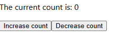
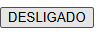
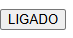

# Exercico - Aula 18 - 13/12/24

### Problema 1 - Contador

- Criado o componente **Contador.jsx** na pasta Components aonde ficam todos os componentes criados
- Feito uma função contador aonde dentro dela se encontra outras duas funções a **Adicionar** que soma o numero do contador em 1 e a função **Retirar** que subitrai do contador em 1 e que em caso o valor do contador seja 0 não faça nada para não haver numero negativo no contador
- A função Contador retorna uma mensagem de texto e o valor atual do contador
- As funções Adicionar e Retirar foram atreladas cada uma em um botão para quando forem clicadas executares suas funções determinadas
- No arquivo App.js foi importado a função Contador e adicionado o componente para exibição do contador e dos botões

### Problema 2 - BotaoAlternador

- Criado o componente **BotaoAlternador.jsx** na pasta Components
- Foi feita a função **BotaoAlternador** que atraves de uma variavel em boolean o botão alterna o que se encontra escrito nele
- É utilizado a função **handleClick** para que sempre que o botao for apertado vai acontecer de trocar o estado da variavel **estadoBotao** para ficar variando entre True e False
- Na parte do botão é chamado a função handleClick onde possui um operador ternário que quando o valor for true ira aparecer escrito no botao LIGADO e no caso de false DESLIGADO
- No arquivo App.js foi importado a função BotaoAlternador e adicionado o componente para exibição do botão que inicialmente é gerado no estado DESLIGADO

